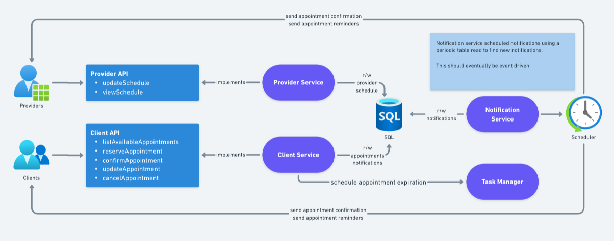

# henrymeds

The application is a Spring Boot application, and uses Flyway to provision an
in-memory H2 database for the integration tests.

## Design

## Architecture
The application is structured to use the following architecture:

  `API -> Domain Controller -> Repository`

### API
This layer provides the request handling and validation.
Once requests are validated, handling is delegated to the domain controller layer.

### Domain Controller
The business logic of the application is encapsulated here.
Domain controllers are responsible for fulfilling requests and interacting with the repository layer.

### Repository
Repositories handle database interaction. This implementation uses the jOOQ library to generate the code representing
the database tables, and allows easy interaction with table structures.

## Building
The application is built using Maven. To do a full build and execute the tests, run:
`mvn clean install`

## Code Coverage
The following is the code coverage report (generated by IntelliJ when running the entire test suite):

